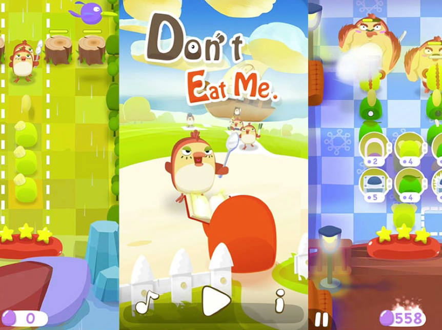

# 不要吃我

> 2014-2015 手游

* 暂时只有iOS版本
* 个人完成全流程:立项,游戏策划,交互设计,UI设计,角色设计,场景设计,动画设计,iOS开发.
* 这个项目是离职之后全职在做,项目花费的时间太长了，因为懵懂，燃烧了青春。

#体验游戏
* 游戏视频预览链接: http://pan.baidu.com/s/1mhivoG4 密码: pnw9
* ipa包下载链接：http://pan.baidu.com/s/1c0AVf0G  密码：fo9q
* 安装ipa包需要越狱的设备.测试机型尽量用以下型号:iPhone5,iPhone5s,iPhone6,iPhone6+,iPad4,iPadAir,iPadAir2.

***
# 这一年，我的工作内容到底有哪些？
> 开发过程记录:http://pan.baidu.com/s/1gfhnKwr
###策划
> 游戏核心玩法设定
设计游戏兵种，关系互克，技能
设计关卡剧情，80关流程奖励方式
设计游戏经济体系，商场，内付费，分享
等等…

###美术
>游戏原画
场景设计
角色设计
角色动画
特效
交互设计
UI设计

###程序
> 
**MVC框架**
* 模型: 用户数据和战斗数据
* 控制器: 各模块之间的交涉
* 视图: UI视图, 场景视图, 角色视图
**战场模块**
* 战斗逻辑：攻击，移动，施法，休息，受到的Buff(7种)切换。
* 战场场景铺建，怪物生成控制器，能量体系。
* 所有单位功能实现： 27种怪物，19种塔，38个技能
**非战场的其他模块**
* 内付费
* 接入第三方分享SDK
* 大地图寻路，关卡开启
* 资源解析
* UI界面

###琐事
>Appstore录屏，照片，扒音效，买便宜的正版音乐，开户，购买开发者账号，寻找发行商
给团队打鸡血
给家里人打鸡血
给自己打鸡血（曾几何时，我整个人已然是个鸡血）